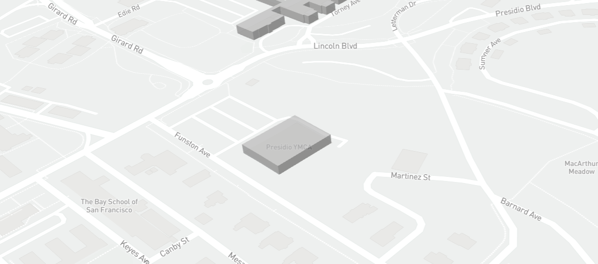
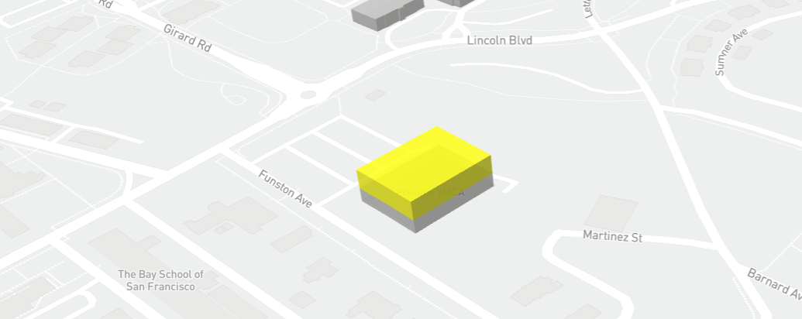

# Stacks

The stacks that are used to visualize the footprints of 3d building are as follows:

* Mapbox-gl
* Turf Js

Initially all the buildings are loaded. 

And then click on any building to add one storey(polygon) at the top of it.

